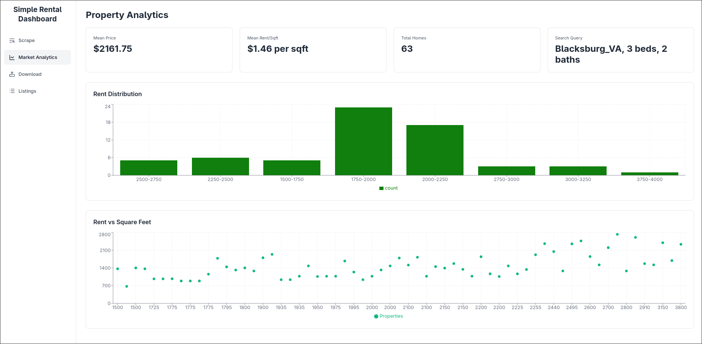
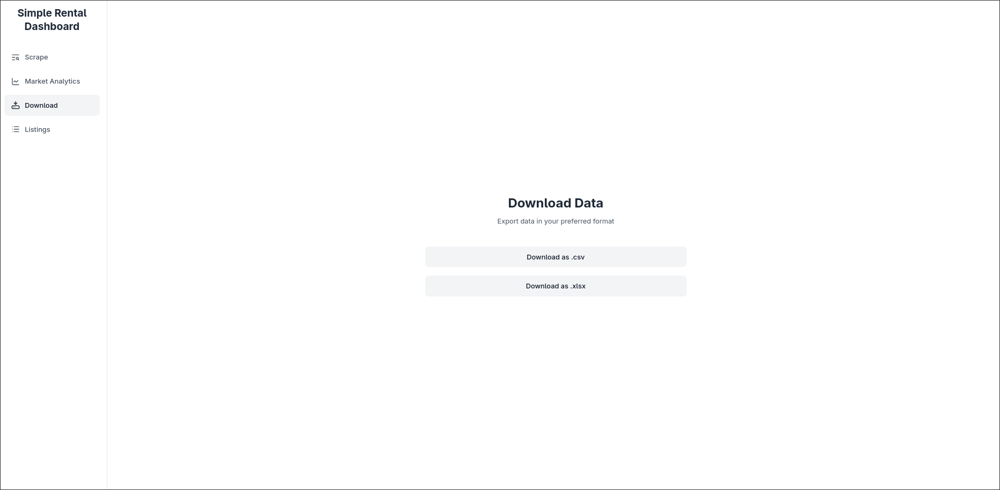
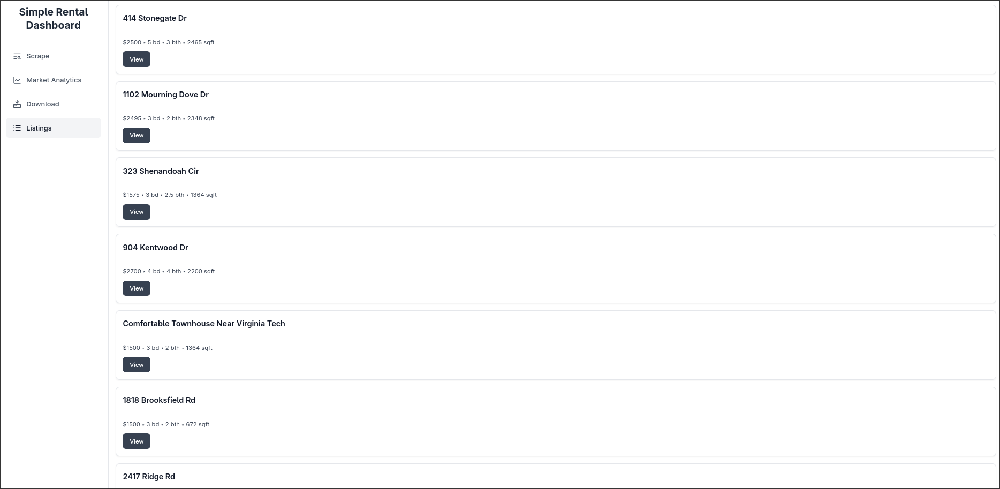

# Rental-Dashboard

## A simple rental dashboard with a python backend that scrapes realtor.com for new listings. Designed to run on linux with x-org display

This project was build as a learning tool for me to understand React.js frameworks and basic data scraping and manipulation. This is mainly designed to run on linux hardware or vms that use x-org display. Undetected Chromedriver doesn't naturally run headless, So I solved that problem by using xvfb.

This project might be forked by me in the future to produce a service that gives even further depth to each listing, potentially creating a database of housing friendly for undergraduate students, as finding student housing can be a challenge for many

## Images of the User Interface:
### Homescreen:

Homescreen that makes query to scraper

### Data Visualization Page:

Visualization of the data with some descriptive statistics on the top

### Download Page

Page that allows you to download data as .csv or .xlsx format

### Listings page 

Compiles listings into a simple list with buttons to redirect user to each listing on realtor.com. Will maybe add pictures in a future iteration

## Installation instructions (without Docker)
### Currently working on docker implementation for this project, however, currently must install more manually

#### 1. Create directory
#### 2. Create virtual environment
On Linux Machine:
* <code>python -m venv myenv</code> then <code>source myenv/bin/activate</code>
#### 3. Install requirements.txt 
* <code>pip install -r requirements.txt</code>

#### 4. Install Node
<code>sudo apt update
sudo apt install nodejs npm</code>

#### 5. Install packages through node
<code>npm install</code>

#### 6. Install xvfb
<code>sudo apt install xvfb</code>

#### 7. Creating <code>.env</code> files
* Create <code>.env</code> file in app root directory:
<code>
REACT_APP_API_URL=http://localhost:4999
REDIS_HOST=redis
REDIS_PORT=6379
</code>

* Create <code>.env</code> file in <code>frontend-react</code> directory:
<code>
REACT_APP_API_URL=http://localhost:4999
</code>

#### 8. Run both <code>app.py</code> and <code>App.js</code>
* <code>python backend/app.py</code>
* <code>cd frontend-react</code>
* <code>npm start</code>

### Now go to <code>http://localhost:3000</code> and the app should be running

## How to alter this project for your own use:
I would reccomend changing the User Interface a bit, but the scraper logic on the backend could definitiely be altered to work on other websites.

## Known Issues
There is an issue where the scraper sometimes pauses and doesn't return anything at the end. I believe this is due to something with memory, however this bug happens when I am not using X-org.

### Thank you for reading and using this project!
A star would be appreciated because this is my first real project!
 

